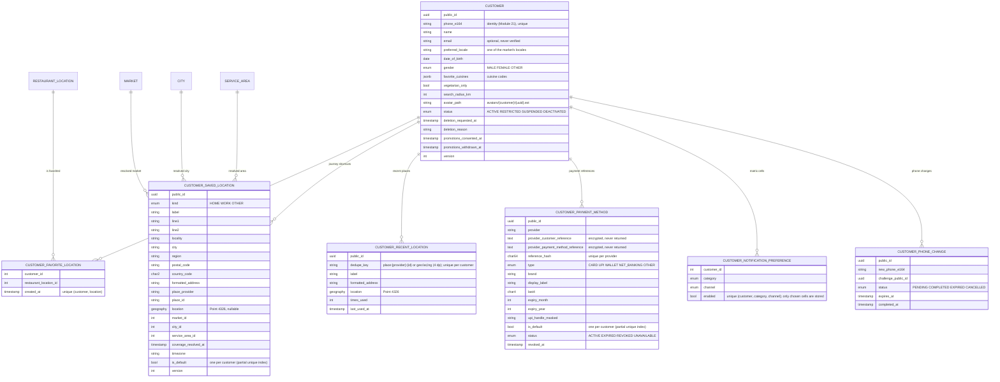
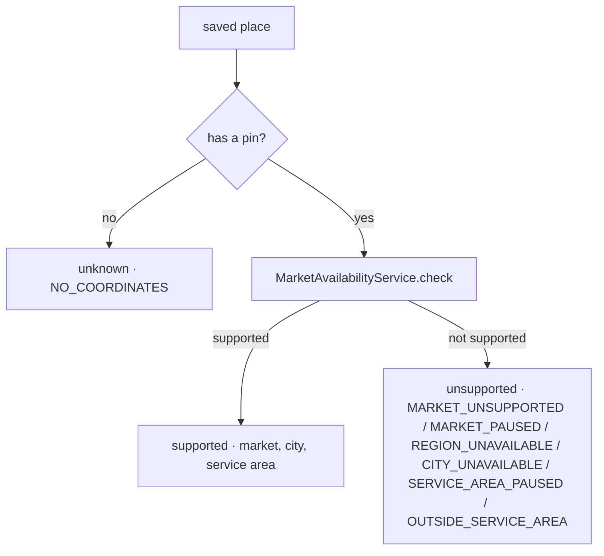

# Customer account domain (Module 25)

The customer's own account on the backend: profile, favorites, saved journey locations, recent places,
payment-method references, notification preferences and the sensitive actions (re-authentication, phone change,
deletion request). The identity stays the Module 21 customer (phone + OTP); this module extends that record and adds
the tables around it. Every endpoint lives under `/api/v1/customer/...`, takes the signed-in customer from the token
and never accepts a customer id from a client. Local development only — nothing here has touched production.

## Entity model

- Migration `2026_10_04_100000_create_customer_account_tables` adds the profile columns to `customers` and creates
  `customer_favorite_locations`, `customer_saved_locations`, `customer_recent_locations`, `customer_payment_methods`,
  `customer_notification_preferences`, `customer_phone_changes`. Integer ids stay internal; public UUIDs are the API
  ids. Enumerations are PHP enums **and** check constraints. Foreign keys: customer rows cascade with the customer
  (a hard delete of a customer is still never done by the API — see "Account management"); a restaurant location
  cascades its favorites; a saved location restricts its market and nulls its city / service area when those go.
- `customers.favorite_cuisines` holds cuisine **codes** of the platform taxonomy (validated on write); the profile
  answers code + name. `preferred_locale` must be one of the market's `supported_locales` (India: `en-IN`); a
  customer without one yet is answered the market default.
- Saved locations are **journey shortcuts** (origin / destination), never delivery addresses: FoodOnTheGo is pickup
  along a journey. The address block is flexible and international (every field optional); the point is optional
  until a Places provider exists (CF-338) — a place without a pin is kept and reported `unknown`.
- Favorites point at a restaurant **location** (a chain is several locations; a customer favors the one they visit).

## Services (`app/Services/Customer`)

| Service | What it decides |
| --- | --- |
| `CustomerProfileService` | The only writer of profile fields: name (plain text, any script), e-mail (lower-cased, optional, never "verified"), locale (from the market's options), birthday, gender, cuisine codes (taxonomy), vegetarian filter, search radius; optional `version` → 409 `stale_update`; `version++`; audit `customer.profile_updated` that records **which** personal fields changed (`from null → "changed"`), never their values. |
| `CustomerAvatarService` | Profile photo checked by content (MIME from the bytes, real dimensions 120–2000 px, ≤ 2 MiB, JPEG / PNG / WebP), stored on the configured disk under `avatars/{customer}/{uuid}.{ext}`, served by `GET /api/v1/media/{path}` (pattern-restricted, immutable); the previous file is deleted on replace / remove. |
| `CustomerFavoriteService` | Add is `insertOrIgnore` on the unique pair (idempotent under concurrency; 201 when created, 200 when it already was one); only **visible** restaurants can be added (404 otherwise); remove is idempotent and works for restaurants that became hidden; the list loads the restaurants with the Module 23 public resource (and the availability answer) in a fixed number of queries; a favorite whose restaurant is no longer visible comes back with its name and `available: false`. |
| `SavedLocationService` | Create / edit / default / delete; coordinates become a PostGIS `geography(Point, 4326)`; market, city and service area are resolved on the server (`MarketAvailabilityService`), never trusted from a client (`market_id`, `customer_id`, … are refused); `coverage` is decided **per request** from the geometry and the current statuses; first saved place becomes the default, exactly one default (partial unique index), the oldest remaining one is promoted on delete; configurable limit (20); `version` on edits; audit without addresses. |
| `RecentLocationService` | Places the customer explicitly chose: deduplicated (`place:{provider}:{id}` or `geo:lat,lng` rounded to 4 decimals), bounded to the newest 10, clearable, pruned after 90 days (`customer:prune-recent-locations`, daily). Never a movement history. Clients wire it in Module 26. |
| `PaymentMethodReferenceService` | References only: provider name, encrypted provider references (never returned), `reference_hash` for dedupe, brand / last4 / expiry / masked UPI handle for display; one default (partial unique index); `EXPIRED` computed from the expiry on read and written back; remove = `REVOKED` (row kept for payment history; the provider-side revocation is Module 30); an unusable method cannot become default. There is **no endpoint that accepts payment details** — `attach()` is called by the provider integration (Module 30) and the local fixtures only. |
| `NotificationPreferenceService` | The category × channel matrix from `config/customer.php`: only cells the customer changed are stored; `ACCOUNT_SECURITY` is locked on `SMS` and `IN_APP` (cannot be switched off); marketing (`PROMOTIONS`, `PRODUCT_UPDATES`) is off until chosen; switching any `PROMOTIONS` channel on stamps `promotions_consented_at`, switching the last one off stamps `promotions_withdrawn_at`; audit per changed cell. Delivery is a later module (push tokens: Module 33). |
| `RecentAuthentication` | "Recent" = the session was signed in within 30 minutes, or a code to the account's own phone was verified on this session within the last 10 minutes (`customer:reauth:token:{id}` in the cache). Sensitive actions call `assert()` → 403 `reauthentication_required`. |
| `CustomerAccountService` | Re-authentication challenge / verify (OTP purpose `customer_reauth`, security event `REAUTHENTICATED`); phone change: parse the new number for the market, refuse the current number (422) and a number in use (409 `phone_in_use`), send the code to the **new** number (purpose `customer_phone_change`), verify, re-check uniqueness, update `phone_e164` + `phone_verified_at`, revoke every other session, events `PHONE_CHANGE_REQUESTED` / `PHONE_CHANGED` with masked numbers; deletion request: idempotent, `deletion_requested_at` + optional reason, `ACTIVE → RESTRICTED` through `AccountStatusService` (sessions stay), event `ACCOUNT_DELETION_REQUESTED`, audit without the reason. |
| `OtpChallengePresenter` | The challenge answer in the same shape as the sign-in challenge (`challenge_id`, masked phone, expiry, resend, attempts, delivery) plus `purpose` and, for a phone change, `change_id`. The code itself is never returned. |

## Coverage answer of a saved place

Market, city and service area ids are stored when the pin is saved (reporting, later journey features), but the
answer a customer sees is recomputed on every read, so a paused area or a new service area is reflected at once.
A place abroad (Dubai, Paris) is saved for the journey and reported `unsupported` — saving it never creates or
activates a market (India is the only active market).

## API

All routes: `auth:customer` + `active` (RESTRICTED accounts may still read and manage their account; SUSPENDED /
DEACTIVATED cannot authenticate). Pagination, errors and versions follow the platform conventions (`docs/backend/README.md`).

| Route | Purpose |
| --- | --- |
| `GET` / `PATCH /customer/profile` | Read / edit the profile (`version` optional → 409 `stale_update`; phone, status, market, roles, verification fields → 422 `prohibited`). The Module 21 `PATCH /auth/customer/profile` stays for the sign-up step. |
| `POST` / `DELETE /customer/profile/avatar` | Upload (multipart `image`) / remove the profile photo. |
| `GET /customer/favorites` | Paginated, newest first, each visible restaurant as `GET /restaurants` shows it. |
| `POST` / `DELETE /customer/favorites/{restaurant}` | Slug or id; 201 / 200 idempotent add (`added`), 204 idempotent remove; hidden restaurant → 404 on add. |
| `GET` / `POST /customer/saved-locations` · `PATCH` / `DELETE …/{savedLocation}` · `POST …/{savedLocation}/default` | Journey shortcuts with coverage; `location: null` removes the pin; IDOR → 404. |
| `GET` / `POST` / `DELETE /customer/recent-locations` | Recent places (API ready; clients wire it in Module 26). |
| `GET /customer/payment-methods` · `PATCH …/{paymentMethod}/default` · `DELETE …/{paymentMethod}` | References only; no `POST` (405); any payment credential in a body → 422 ("FoodOnTheGo never receives payment credentials"). |
| `GET` / `PATCH /customer/notification-preferences` | The matrix; locked cells → 422 on an attempt to switch them off. |
| `POST /customer/account/reauth` · `POST …/reauth/verify` | Code to the account's own phone; `throttle:otp-request` / `otp-verify`. |
| `POST /customer/account/deletion-request` | Needs recent authentication; `{confirm: true, reason?}` → account RESTRICTED, request recorded. |
| `POST /customer/phone-change/request` · `POST …/verify` | Needs recent authentication; code to the new number; other sessions revoked on success. |

The OpenAPI document (`backend/openapi/openapi.json`, enforced by `OpenApiContractTest` and
`CustomerOpenApiContractTest`) is the contract: 114 paths, 203 schemas after this module.

## Privacy (documentation, not a legal policy)

| Data | Why it is kept | Where | Who sees it | Retention today |
| --- | --- | --- | --- | --- |
| Phone (identity), name, e-mail, birthday, gender, preferences | The account itself; preferences personalise discovery | `customers` | The customer (own profile); administrators through the Module 21 admin views (phone masked where listed) | Until erasure (process pending final business & legal approval) |
| Profile photo | Shown on the customer's own profile | configured disk `avatars/{customer}/{uuid}` | Anyone with the exact URL (unguessable UUIDs); the previous file is deleted on replace | Until replaced / removed |
| Favorites | Quick access to restaurants | `customer_favorite_locations` | The customer only | Until removed; kept while a restaurant is hidden |
| Saved places (address + optional pin) | Journey origin / destination shortcuts | `customer_saved_locations` (PostGIS) | The customer only; coordinates never appear in audit or logs | Until deleted (limit 20) |
| Recent places | Faster journey planning | `customer_recent_locations` | The customer only | Newest 10; cleared on request; pruned after 90 days |
| Payment references | Paying without re-entering a method (Module 30) | `customer_payment_methods` — provider references **encrypted**, never a PAN / CVV / UPI PIN / bank credential | The customer sees brand / last4 / expiry / masked handle only | REVOKED rows kept for payment history |
| Notification choices + marketing consent timestamps | Lawful basis for marketing messages | `customer_notification_preferences`, `customers.promotions_*` | The customer | Until changed |
| Security events (re-auth, phone change, deletion request) | Account protection, support | `security_events` (masked phone) | Administrators | Platform retention (Module 21) |
| Audit events | Accountability | `audit_events` — field **names** for personal fields, never values; no addresses, reasons or coordinates | Administrators | Platform retention |

Logging rules in force: no full phone numbers, tokens, codes, provider references, addresses or coordinates in logs
or audit payloads; the API never echoes a code or a provider reference.

## Account management

- Deletion request: recorded (`deletion_requested_at`, optional reason), account `RESTRICTED` (sessions stay, the
  customer can still read and manage their data), security event + audit. Nothing is erased and no `DELETE FROM
  customers` exists in the API. Erasure / anonymisation of order and payment records follows the retention rules —
  **PENDING FINAL BUSINESS & LEGAL APPROVAL** (CF-342). Reactivation policy: pending (CF-343).
- Phone change: the only way the identity changes; see `CustomerAccountService`. Other devices are signed out.
- Data export: not built (CF-344).

## Decisions (register entries of 2026-10-03/04)

Favorites = restaurant locations; saved locations = journey shortcuts (not delivery); nullable pin + per-request
coverage; recent places kept server-side (bounded, deduplicated, pruned); payment references only, no credential
endpoint, revoke = local REVOKED until Module 30; notification matrix with locked security channels and explicit
marketing consent; re-authentication = fresh session (30 min) or OTP (10 min window); deletion = RESTRICTED +
record, erasure pending legal; phone change by OTP to the new number with session revocation; English only; the
Module 21 onboarding profile route kept; account implementation in the apps follows the sign-in mode.
