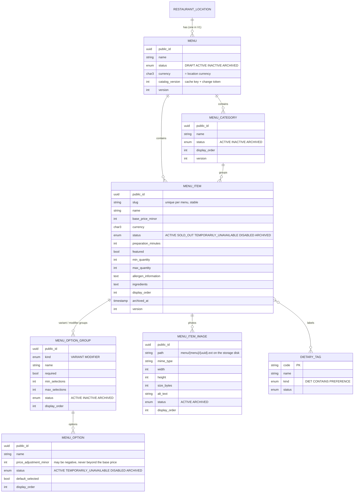
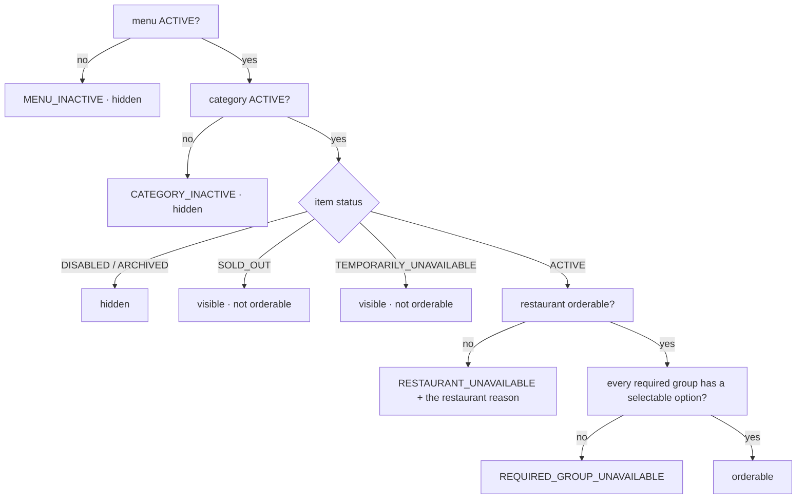

# Menu domain (Module 24)

One menu domain for three audiences — restaurant staff (Restaurant Dashboard), customers (Customer Web, Android)
and administrators (Platform Admin, read-only). Everything a customer may see or order is decided by the backend;
every price a customer is shown is an integer amount of minor units in the menu's currency, and the only price
that is ever charged is the one the backend calculates.

## Entity model

- Tables: `menus`, `menu_categories`, `menu_items`, `menu_option_groups`, `menu_options`, `menu_item_images`,
  `dietary_tags`, `menu_item_dietary_tags` (migration `2026_10_03_100000_create_menu_tables`). Integer ids stay
  internal; the public UUID is the API id. Statuses are checked constraints in PostgreSQL as well as PHP enums.
- A menu belongs to one location and is created on first use (`ACTIVE`, name "Menu") in the **location's
  currency** — a client never sends a currency. The model allows several menus per location; V1 uses one.
- Variants and modifiers are **one** structure (`menu_option_groups.kind`) with the same rules: `required`,
  `min_selections`, `max_selections`; a group's options carry a price adjustment in the menu currency. The kind only
  tells the apps where to show the group.
- Dietary tags are data (`DietaryTagSeeder`: Vegetarian, Non-vegetarian, Vegan, Jain, Contains egg / nuts / dairy,
  Gluten-free, Dairy-free, Halal), never safety claims; `allergen_information` is free text written by the
  restaurant.
- Nothing customers may have seen is deleted: categories, items, groups, options and images are **archived**
  (orders will snapshot what they sold — Module 31). An item keeps its slug when it is renamed; the slug changes
  only when the restaurant sends a new one.

## Services (`app/Services/Menu`)

| Service | What it decides |
| --- | --- |
| `MenuService` | The only place a menu changes: menu, categories (create, edit, archive when empty, reorder as one permutation), items (create with tags + groups in one transaction, edit with version, status switch, bulk switch, archive, duplicate, reorder), option documents (`groups` replaces the configuration; ids keep existing rows, the rest is archived), invariants (max ≥ 1, min ≤ max, required ⇒ min ≥ 1 and one selectable option, max ≤ options, a reduction never beyond the base price), audit of every change (`menu_item.price_changed`, `menu_item.status_changed`, `menu_option.price_changed`, …), `catalog_version` bump. Every write locks the menu row (`lockForUpdate`), so edits of one menu are serialised. |
| `MenuPricingService` | The price authority: validates a selection (unknown / duplicate group or option, unavailable option, required, min, max, quantity bounds → 422 `invalid_selection` with `details.issues`) and returns a `PriceQuote` (base + adjustments = unit, × quantity = line, currency). A configuration below zero is refused (`invalid_price`). The cart (Module 27) uses the same service. |
| `MenuAvailabilityService` | `evaluate(item, menu, category, restaurantState)` → `visible` / `orderable` / reason in a fixed order: menu ACTIVE → category ACTIVE → item state → restaurant orderable → every required group has a selectable option. Reasons: `RESTAURANT_UNAVAILABLE`, `MENU_INACTIVE`, `CATEGORY_INACTIVE`, `ITEM_SOLD_OUT`, `ITEM_TEMPORARILY_UNAVAILABLE`, `ITEM_DISABLED`, `ITEM_ARCHIVED`, `REQUIRED_GROUP_UNAVAILABLE` (`OUTSIDE_ITEM_SCHEDULE` reserved). Sold-out and temporarily unavailable items stay visible; disabled, archived, inactive categories and inactive menus are not shown. |
| `MenuCatalog` | Cache of the customer documents keyed by `menu:{id}:v{catalog_version}:{suffix}`; every customer-visible write increments `catalog_version` inside the transaction, so stale entries are never reached again (no explicit flush). The restaurant's open / accepting answer is never cached — it is merged per request. |
| `MenuImageService` | Photos checked by **content** (MIME from the bytes, real dimensions, size, count limit), stored on the configured disk under `menu/{menu}/{uuid}.{jpg,png,webp}`, served by `GET /api/v1/media/{path}` (pattern-restricted, `Cache-Control: immutable`); removing archives the row and keeps the file; duplicating an item copies the files. |
| `MenuSlug`, `MenuValidation`, `MenuPresenter` | Slug rules (`^[a-z0-9]+(-[a-z0-9]+)*$`, "item" + counter for scripts without ASCII), request rules shared by the controllers, the three faces of the document (management / customer / admin). |

## Availability answer

## API

Customer (no token, `throttle:search`): `GET /restaurants/{slug}/menu` (ACTIVE menu, ACTIVE categories with at
least one visible item, visible items with prices, images, labels and the availability answer; `menu: null` when
nothing is published; 404 `restaurant_not_found` for a restaurant customers may not see), `GET
/restaurants/{slug}/items/{itemSlug}` (groups and the options a customer may see; 404 `item_not_found` for
disabled / archived / hidden / another restaurant's item), `POST …/price-quote` (stateless; `unit_price_minor` /
`price` in the body → 422). `GET /media/{path}` serves item photos (no throttle, immutable).

Restaurant (`auth:restaurant`, ACTIVE membership; `restaurant.menu.view` to read, `restaurant.menu.manage` to
write; 404 when the location is not theirs): `GET|PATCH /restaurant/locations/{location}/menu`
(`?include=archived`), `POST …/menu/categories`, `POST …/menu/categories/reorder`, `PATCH|DELETE
/restaurant/menu/categories/{category}`, `POST …/categories/{category}/items/reorder`, `POST
/restaurant/locations/{location}/menu/items`, `POST …/menu/items/status` (bulk), `GET|PATCH|DELETE
/restaurant/menu/items/{item}`, `PATCH …/{item}/status`, `POST …/{item}/duplicate`, `POST …/{item}/images`
(multipart), `PATCH|DELETE …/{item}/images/{image}`. Edits carry `version` (409 `stale_update`); status switches do
not (the last request wins); archiving is final (409 `item_archived` / `category_archived` afterwards; 409
`category_not_empty` while a category still holds items).

Admin (`auth:admin`, `admin.restaurants.view` in the location's market): `GET /admin/restaurants/{location}/menu` —
the customer document plus counts per state and the hidden categories. There is no admin write route.

`GET /restaurant/taxonomy` now also lists the dietary tags and the menu limits (`config/menu.php`: name 120,
description 1000, 60 categories per menu, 300 items per category, 12 groups per item, 40 options per group, 6 tags
per item, 6 images per item of 2 MiB and 200–4000 px, prices 0–10 000 000 minor units, preparation 0–240 min,
quantity 1–50 per line, instructions 200 characters).

## Decisions (register entries of 2026-10-03)

1. One menu per location, created on first use, ACTIVE, in the location's currency; a client never sends a currency.
2. One table for variants and modifiers (`kind`), same required / min / max rules.
3. The option configuration of an item is replaced as one document; ids keep existing rows (stable for carts),
   missing rows are archived, never deleted.
4. Slugs are created once from the name, unique per menu, changed only by an explicit `slug` field.
5. Duplicate = deep independent copy named "… (copy)" that starts DISABLED; images are copied as new files.
6. Negative adjustments are allowed (configurable) but never beyond the base price; a configured price can never be
   below zero.
7. Status switches have no version (the last request wins); edits do (409 `stale_update`).
8. `catalog_version` is bumped on every customer-visible change and is both the cache key and the token clients
   carry to notice a changed menu (Module 27 stale detection). No explicit cache flush.
9. The customer availability merge order is the item's own reason → the restaurant → an unsatisfiable required
   group; for administrators looking at an unpublished menu, `MENU_INACTIVE` comes first.
10. Media are served by the API on the request host (`GET /api/v1/media/{path}`), so phones reach them through the
    local proxy; the path pattern is restricted; files are kept when images are archived.
11. The price quote is stateless and answers 200 with the availability block even when the item cannot be ordered
    right now; refusals are 422 with issue codes.
12. A menu read for a hidden restaurant is a plain 404; a restaurant without an ACTIVE menu answers 200 with
    `menu: null`; an ACTIVE category without visible items is left out of the customer document.
13. Archiving a category requires it to be empty (409 `category_not_empty`).
14. Administrators read menus only; a write would need its own permission and audit (not built).
15. Dietary tags are a platform list (codes) — informational, never a safety claim; allergen text is the
    restaurant's free text.
