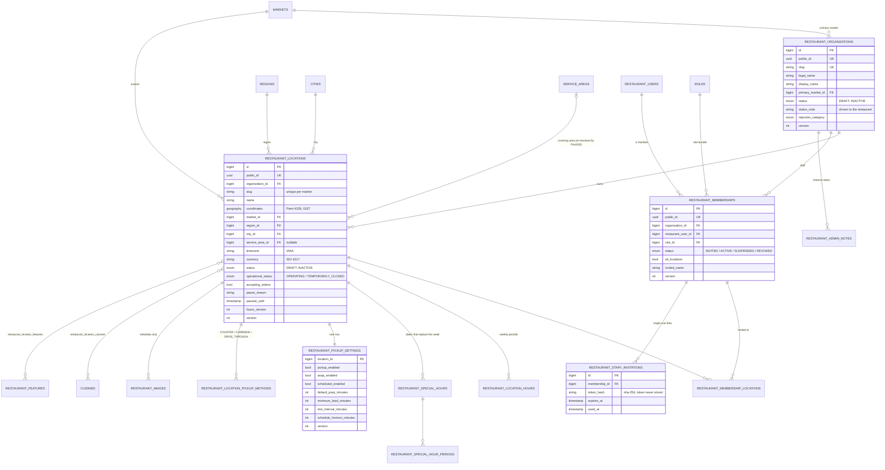
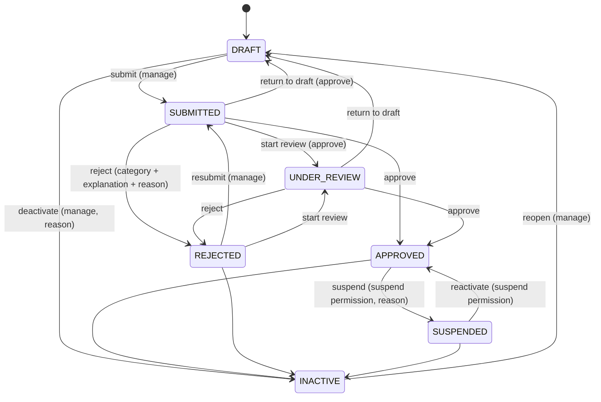
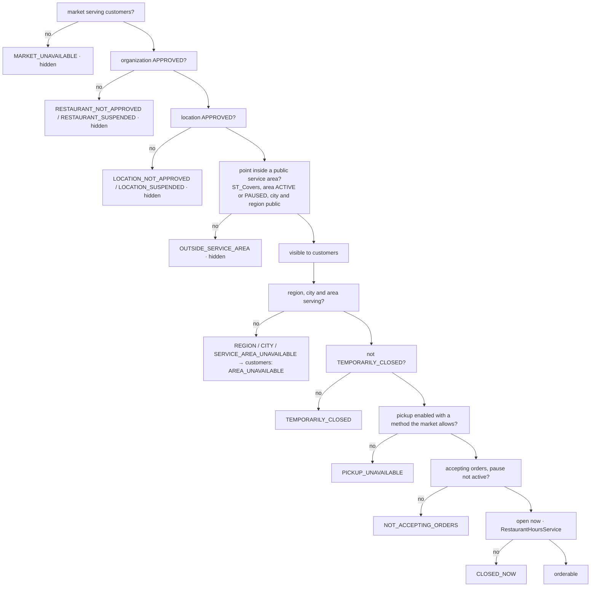
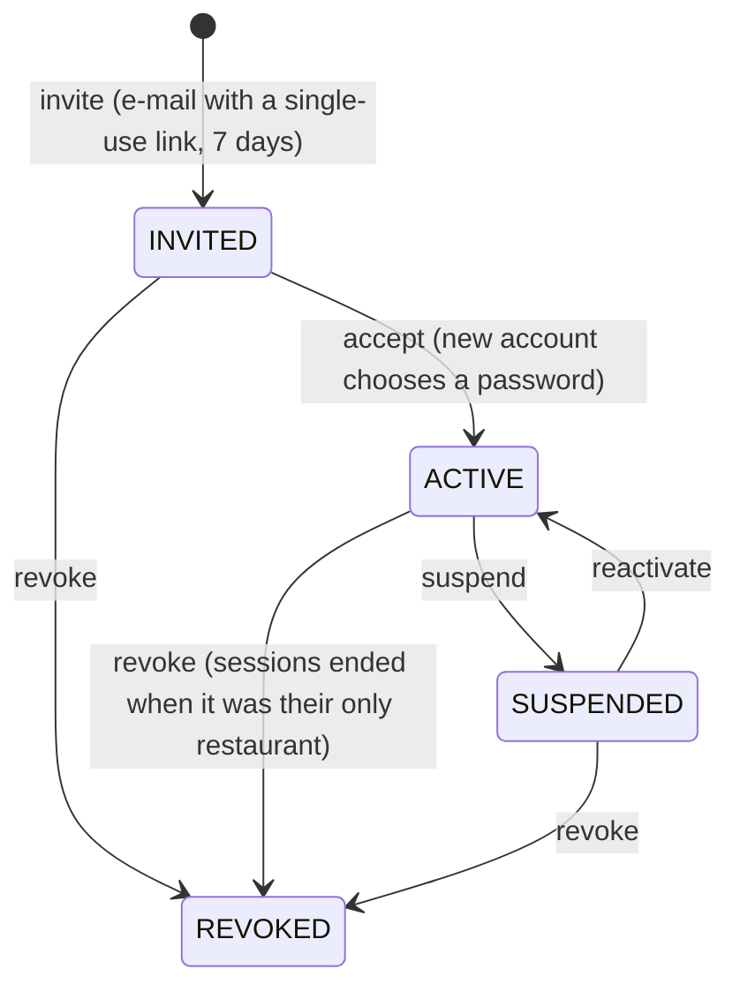

# Restaurant domain (Module 23) — data model and lifecycles

Local development documentation. The authoritative definitions are the migration
`backend/database/migrations/2026_10_01_200000_create_restaurant_tables.php`, the enums in `backend/app/Enums`
and the services in `backend/app/Services/Restaurant`. Everything below runs locally only; nothing is in production.

## Entity model

Money never appears in this module; every amount-bearing feature (menus, orders, payments) is a later module.

## Where a restaurant stands — two independent lifecycles

An organization (the business) and each of its locations (an outlet customers see as "a restaurant") have the same
status machine, moved only by administrators (`RestaurantLifecycleService`). Approving one never rewrites the
other: a suspended organization hides all its locations; one location can be suspended while the rest keep trading.

The permission a move needs is `RestaurantStatus::permissionFor()`: `admin.restaurants.approve` for review /
approve / reject / return to draft, `admin.restaurants.suspend` for suspend / reactivate, `admin.restaurants.manage`
for everything else. Rejecting, suspending and deactivating need a reason (internal, audit trail); rejecting also
needs a category and an explanation the restaurant may read (`status_note`, shown in its dashboard while the
status is current).

## What a customer may see and order — `RestaurantAvailabilityService`

Decided per request from the stored facts and the PostGIS geometry; the stored `service_area_id` is an index for
lists and is re-resolved whenever a location is created, moved or the geography changes.

A hidden restaurant is a plain 404 for customers (no hint that it exists). Staff and administrators see the full
reason.

## Opening hours — `RestaurantHoursService` / `Schedule`

- Weekly periods per day of week (0 = Sunday), up to four a day, `HH:MM` wall-clock in the location's time zone;
  `closes_at` at or before `opens_at` runs past midnight, equal means 24 hours. Overlaps are refused — also across
  midnight and across the week boundary.
- Special hours replace the periods opening on one local date (closed, or other periods, with a note for customers);
  a period that opened the evening before still runs to its end.
- Back-to-back periods are one opening when the closing time is computed; "around the clock" has no closing time.
- The customer apps recompute "open now" from the same hours with the same rules so a page left open stays right.

## Staff and permissions — `RestaurantStaffService` / `RestaurantAccess`

- A membership is the source of truth; the role assignments the RBAC layer evaluates are derived from it
  (`sync()`): organization scope for "all locations", one assignment per location otherwise.
- Every restaurant route names an organization or location: `RestaurantAccess` answers 404 when it is not one of
  the caller's ACTIVE memberships and 403 when the permission is missing there. Nothing trusts an id in a body.
- Staff changes need `restaurant.staff.manage` across the whole organization; nobody changes their own
  membership; nobody grants a role that may do more than they may; the last member who can manage staff across
  all locations cannot be removed or demoted; a revoked membership stays for history and can be re-invited.
